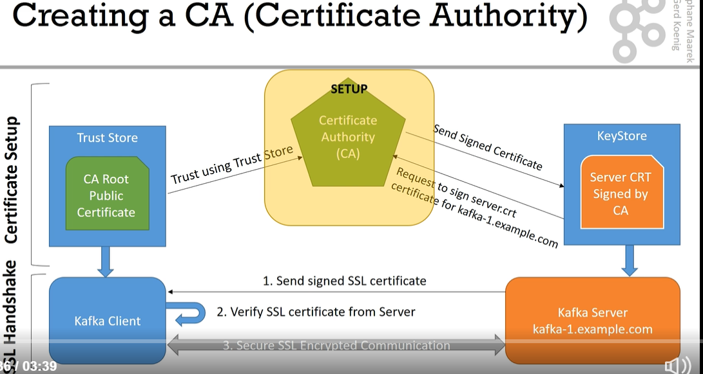
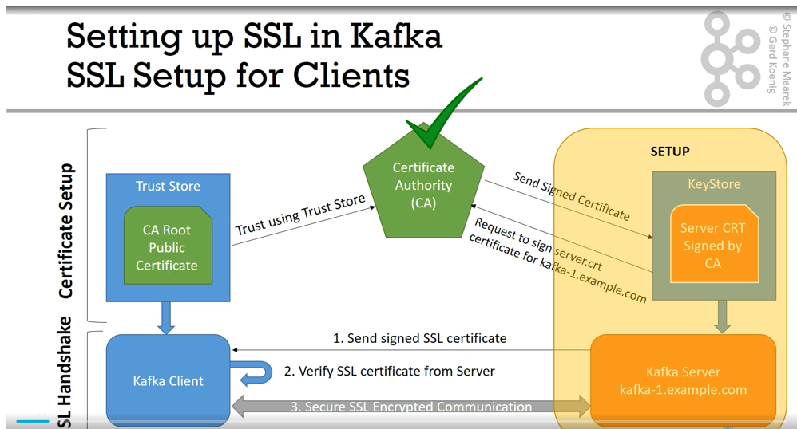
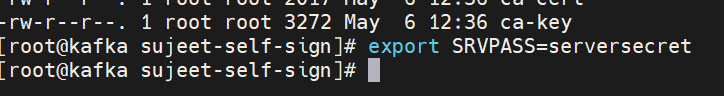
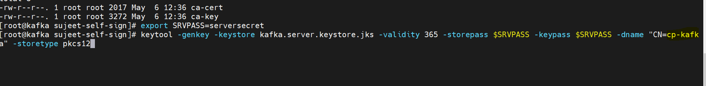
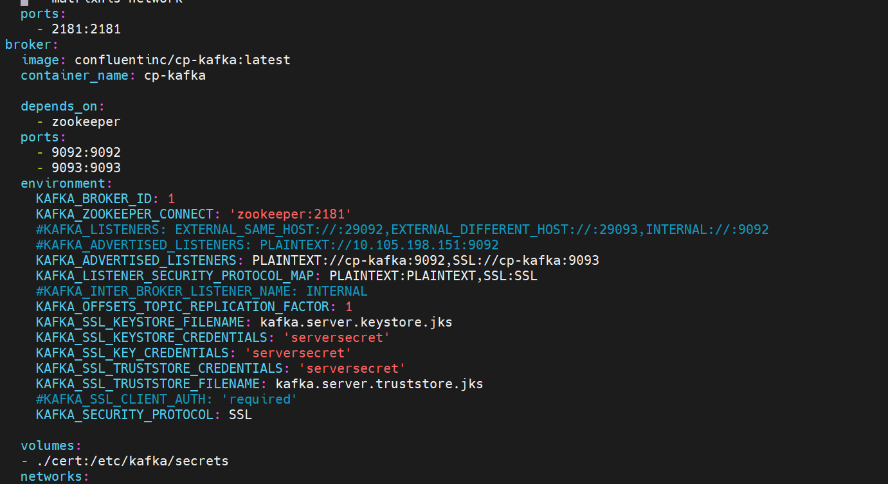
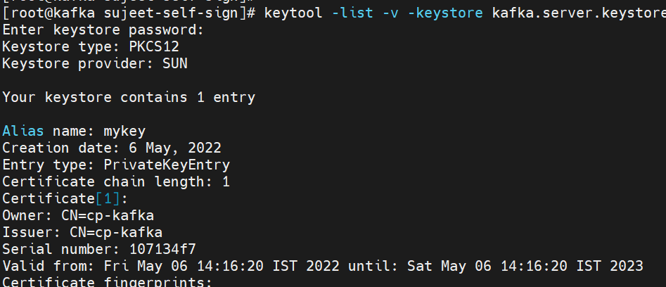
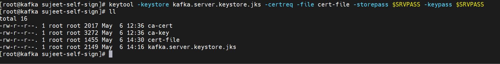
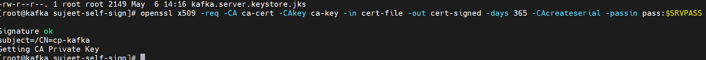
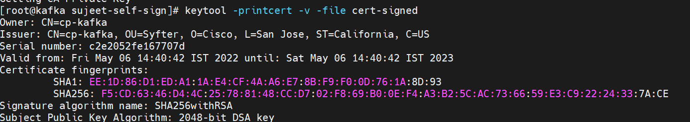
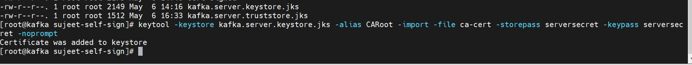

# Kafka-Certificate

### Self- Sign

Creating CA
=====
- create a sub-directory to separate all ssl related work.
- /usr/local/bin/config/sujeet-self-sign
- `openssl req -new -newkey rsa:4096 -days 365 -x509 -subj "/C=US/ST=California/L=San Jose/O=Cisco/OU=Syfter/CN=cp-kafka" -keyout ca-key -out ca-cert -nodes`
- We are requesting a new key with RSA encryption with key length 4096. Duration 365
as a result of command we are going receive 2 files.
- ca-key , which is private key for our CA.
- ca-cert , which public one , we can use it for importing on truststore and key store.
- ca-key , should never ever be publicly available.
- ca-cert , is a public certificate, could be distribute anyone , who needs to trust your CA one.

Creating broker keystore and truststore
========
- We will configure a `keystore & truststore` for kafka broker.
- Kafka broker to use SSL port on 9093.
- 
- Always keep the above diagram in mind.
- First set an environment variable server password.
- Confluent kafka , needs this to store in a file.
- Let's export srvser password environment variable.
- 

Create Kafka broker Server certificate
========
- Now create a kafka broker certificate using `keytool`
- most important step is `CN - common name` , We should have public dns name of host.
- 
- We have used `cp-kafka`, which is our docker service name for the host.
- ` keytool -genkey -keystore kafka.server.keystore.jks -validity 365 -storepass $SRVPASS -keypass $SRVPASS -dname "CN=cp-kafka" -storetype pkcs12
  `
- By running the above command we have java keystore ready .
- For debugging purpose, we can view the keystore content.
- `keytool -list -v -keystore kafka.server.keystore.jks
  `
- 
- 
- Next step is getting a signed version of certificate for our kafka broker.
- So that all client outside can verify if certiifcate of kafka broker validate.
- We are going to use keytool command to achieve the signing.
- Signing has 2 steps. one is get the Signing request which is below command
- `keytool -keystore kafka.server.keystore.jks -certreq -file cert-file -storepass $SRVPASS -keypass $SRVPASS`
- 
- The file cert-file , is a signing request and we now need to send to CA.
- So that CA can sign our certificate.
- In real world scenario , take this `cert-file` send it to CA admin,
  we should get back a signed version of our certificate.
- But We have now self signed one , so run below command.
- Sign with our CA, we need `openssl` command.
- `openssl x509 -req -CA ca-cert -CAkey ca-key -in cert-file -out cert-signed -days 365 -CAcreateserial -passin pass:$SRVPASS
  `
- 

- we get cert-signed , which is signed certificate of our kafka broker.
- `keytool -printcert -v -file cert-signed`

- You can see below image for details , `CN = <docker-service-name>`
  and you can see `Issuer , also same name, but not mandatory`

- Next Step is create a `truststore` for our kafka-broker
- We are going to use `keytool ` command.
- adding alias CARoot , truststore and our own public certificate issued by 
- `keytool -keystore kafka.server.truststore.jks -alias CARoot -import -file ca-cert -storepass $SRVPASS -keypass $SRVPASS -noprompt
  `
- alias CARoot, ca-cert , we are creating a truststore importing our pub 

- 

- Now we need to add CA to keystore
- `keytool -keystore kafka.server.keystore.jks -alias CARoot -import -file ca-cert -storepass serversecret -keypass serversecret -noprompt
  `
- 
- Above we are importing public ca-cert 
- `keytool -keystore kafka.server.keystore.jks -import -file cert-signed -storepass serversecret -keypass serversecret -noprompt
  `
- In real world no ca-cert or ca-key ..it is with Cisco
- cert-signed , should be imported to kafka broker.
- truststore and keystore signed with cert-signed. 
  
SSL Client Set up 
==========
- `export CLIPASS=clientpass`
- In client machine too create a ssl client folder if you doing in a different machine
- Create a truststore for our clients.
- importing public CA certificate means 
- get `ca-cert` if it has been generated in different machine.
- `keytool -keystore kafka.client.truststore.jks -alias CARoot -import -file ca-cert -storepass $CLIPASS -keypass $CLIPASS -noprompt`

### Cisco Certified

CN == Cisco certificate with docker service 

## Only Commands
- keytool -keystore kafka.server.keystore.jks -alias localhost -keyalg RSA -validity 365 -genkey
- openssl req -new -x509 -keyout ca-key -out ca-cert -days 365
- keytool -keystore kafka.client.truststore.jks -alias CARoot -importcert -file ca-cert
- keytool -keystore kafka.server.truststore.jks -alias CARoot -importcert -file ca-cert
- keytool -keystore kafka.server.keystore.jks -alias localhost -certreq -file cert-file
- openssl x509 -req -CA ca-cert -CAkey ca-key -in cert-file -out cert-signed -days 365 -CAcreateserial -passin pass:capass
- keytool -keystore kafka.server.keystore.jks -alias CARoot -importcert -file ca-cert
- keytool -keystore kafka.server.keystore.jks -alias localhost -importcert -file cert-signed

- openssl req -new -newkey rsa:4096 -days 365 -x509 -subj "/C=US/ST=California/L=San Jose/O=Cisco/OU=Syfter/CN=localhost" -keyout ca-key -out ca-cert -nodes
- keytool -genkey -keystore kafka.server.keystore.jks -validity 365 -storepass $SRVPASS -keypass $SRVPASS -dname "CN=localhost" -storetype pkcs12
- keytool -keystore kafka.server.keystore.jks -certreq -file cert-file -storepass $SRVPASS -keypass $SRVPASS
- openssl x509 -req -CA ca-cert -CAkey ca-key -in cert-file -out cert-signed -days 365 -CAcreateserial -passin pass:$SRVPASS
- keytool -keystore kafka.server.truststore.jks -alias CARoot -import -file ca-cert -storepass $SRVPASS -keypass $SRVPASS -noprompt
- keytool -keystore kafka.server.keystore.jks -alias CARoot -import -file ca-cert -storepass serversecret -keypass serversecret -noprompt
- keytool -keystore kafka.server.keystore.jks -import -file cert-signed -storepass serversecret -keypass serversecret -noprompt
- keytool -keystore kafka.client.truststore.jks -alias CARoot -import -file ca-cert -storepass $CLIPASS -keypass $CLIPASS -noprompt