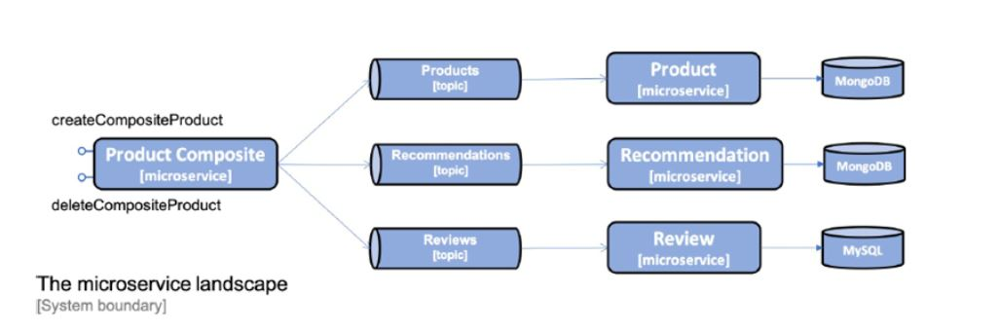
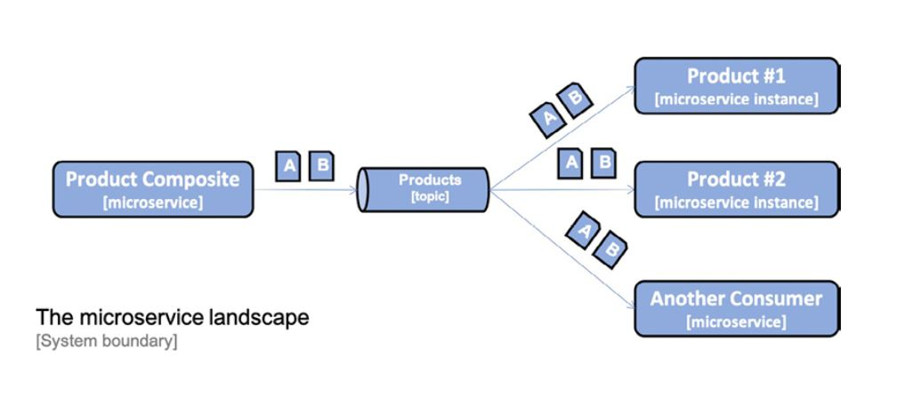
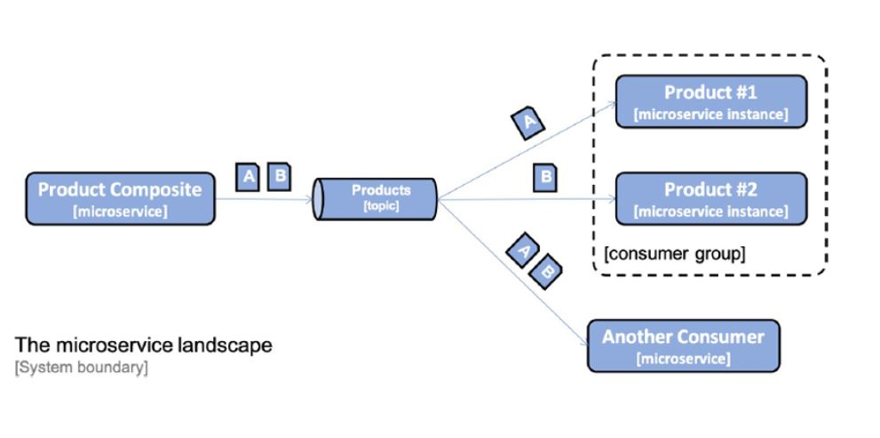

# Developing Event Driven Asynchronous services

This programming model can be used independently of the messaging system used, for example, RabbitMQ or Apache Kafka!

## Handling challenges with messaging

Create and Delete services going to use Spring Cloud Stream.
The Programming model is based on functional paradigm.
where functions implementing one of the functional interface.

There are cases where the actual source data may be coming from external source
, that is not binder. Streambridge plays the role of helper.

Consumer groups
==============
problem:
==========
If we scale up the number of instances of a message
consumer, I mean if we start 2 instances of Produt Service.
, Both instance of product microservice
will consume same messages as below.

This would bring data inconsitency. There fore
we only want one instance per consumer 
to processeach message. `Consumer Group`

